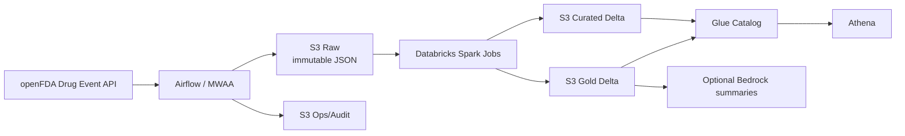

# Architecture

This project is built around the target portfolio architecture first:
- Airflow orchestrates the pipeline.
- S3 is the system of record for raw, ops/audit, curated, and gold.
- Databricks Spark jobs transform raw JSON into Delta tables.
- Glue Catalog and Athena provide metadata and SQL access.

Local development uses MinIO only as an S3-compatible emulator.

## Local Development Flow

```mermaid
flowchart LR
    A["openFDA Drug Event API"] --> B["Airflow DAG: openfda_ingest_raw"]
    B --> C["extract_openfda.py"]
    C --> D["raw_checks.py"]
    D --> E["MinIO raw prefix<br/>raw/openfda/drug_event/..."]
    D --> F["MinIO ops/audit prefix<br/>ops/audit/..."]
    E --> G["Airflow DAG: openfda_build_curated_gold"]
    G --> H["case_header_runtime.py<br/>select latest raw batch"]
    H --> I["Databricks Jobs API payload<br/>Git source + shared job cluster"]
    I --> J["Spark/Delta curated jobs<br/>Python scripts from Git"]
    J --> K["Curated Delta tables"]
    K --> L["Gold Delta tables"]
    L --> M["Glue Catalog registration"]
    M --> N["Athena validation and views"]
```

## Current Code Path

The implemented ingestion flow is fully runnable locally today:
- Airflow resolves a lagged daily scheduled window or a manual batch window.
- Scheduled raw ingestion runs behind a configurable source lag because FAERS/openFDA is updated quarterly and may lag by 3+ months.
- The openFDA client paginates by `receivedate`, auto-extends low page caps when openFDA reports more records than expected, and decomposes manual multi-day windows into daily API queries.
- Raw records are wrapped in bronze-style envelopes and written as immutable NDJSON.
- A batch audit document is written even when raw DQ fails.

The current curated scope includes:
- `curated_case_header`
- `curated_primary_source`
- `curated_patient_demo`
- `curated_case_drug`
- `curated_case_drug_openfda`
- `curated_case_reaction`

The current gold scope includes:
- `gold_latest_case_helper`
- `gold_case_seriousness_trends`
- `gold_drug_reaction_trends`
- `gold_reaction_demographic_trends`
- `gold_manufacturer_class_serious_trends`

The Airflow curated/gold DAG now prepares a Git-backed Databricks Jobs API `runs/submit` payload. In dev, submission is disabled by default so the payload can be reviewed without needing live Databricks credentials. In the AWS-oriented config, submission is enabled and reads Databricks `host` and `token` from AWS Secrets Manager. The job cluster uses the configured AWS instance profile to read and write S3 raw, curated, gold, and ops paths.

After Databricks finishes, `openfda_refresh_metadata` can register the Delta table locations for Glue/Athena.

## Target AWS Architecture

## Why MinIO Exists In Dev

MinIO is only the local development substitute for S3.

It lets us:
- test S3 object writes and prefix layout locally
- keep the boto3 code identical between dev and AWS
- avoid coupling local development to a live cloud account

The portability comes from configuration:
- in dev, `S3_ENDPOINT_URL` points boto3 at MinIO
- in AWS, `S3_ENDPOINT_URL` is removed and boto3 uses native S3

## AWS Service Plan

Planned AWS services by layer:
- orchestration: Airflow, with MWAA as the clean hosted target
- storage: Amazon S3 for `raw`, `ops/audit`, `curated`, and `gold`
- transforms: Databricks Spark jobs writing Delta Lake tables to S3
- metadata: AWS Glue Catalog
- query layer: Athena
- secrets: Secrets Manager for Databricks tokens and any protected configs
- security and ops: IAM, KMS, and CloudWatch

## Migration From Dev To AWS

The code path is designed so the migration is mostly configuration and packaging:
- replace MinIO bucket settings with a real S3 bucket
- remove `S3_ENDPOINT_URL`
- switch from static local credentials to IAM roles
- package the curated Spark jobs for Databricks execution
- upload the `src/curated/*.py` Spark scripts to the configured `databricks.python_file_base_uri`
- register curated and gold Delta tables in Glue
- query them through Athena
