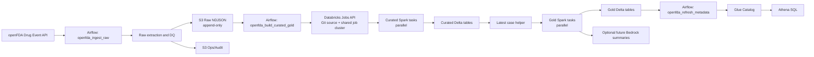

# Architecture

This project implements a batch pharmacovigilance reporting pipeline on an AWS-style lakehouse architecture. It is designed around openFDA drug adverse event data, Airflow orchestration, S3 storage zones, Databricks Spark transformations, Delta Lake outputs, and Glue/Athena query access.

The goal is safety signal monitoring and reporting. The pipeline does not diagnose patients, prove causality, or assert that a drug caused a reaction. Drug-reaction outputs should be read as co-reporting patterns within the same safety report.

## End-To-End Flow



## Storage Zones

Raw is the immutable system-of-record landing zone. Each run writes a new batch under a query-window and ingest-batch prefix, so repeated runs do not overwrite previous raw data.

Ops stores operational metadata such as ingestion audit records, Athena query results, and smoke-test markers.

Curated contains normalized Delta tables that preserve all report versions. The report version key is `safetyreportid` plus `safetyreportversion`.

Gold contains latest-version reporting tables for trend analysis. Gold jobs read curated data, select the latest report version per `safetyreportid`, and rebuild only affected `report_year` and `report_month` partitions.

## Airflow Orchestration

`openfda_ingest_raw` resolves a scheduled or manual window, extracts openFDA drug event records by `receivedate`, runs raw DQ checks, writes raw NDJSON to S3, and writes an audit record to ops.

`databricks_smoke_test` submits a single Git-backed Databricks task to validate API auth, cluster creation, instance-profile S3 access, and basic S3 read/write behavior.

`openfda_build_curated_gold` selects the latest raw batch for a window unless a specific `ingest_batch_id` is supplied. It creates or resets a saved Databricks Job and triggers `run-now`. Curated tasks run in parallel, `gold_latest_case_helper` waits for the curated layer, and the final gold trend tasks run in parallel after the helper is built.

`openfda_refresh_metadata` registers curated and gold Delta locations in Glue through Athena DDL. It can recreate stale Glue table entries without deleting S3 data by using `force_recreate=true`.

## Databricks Job Design

The Databricks path uses Git source execution. Spark Python tasks point to repo-relative files such as `src/curated/build_case_header.py`, which keeps the execution path close to how the project is developed and reviewed.

The curated/gold job uses a shared job cluster instead of creating one cluster per task. The cluster is configured with an AWS instance profile for S3 access and with Delta deletion vectors disabled for Athena compatibility:

```json
{
  "spark.databricks.delta.properties.defaults.enableDeletionVectors": "false"
}
```

The cluster-level setting matters because Athena's native Delta reader cannot read Delta tables created with newer deletion-vector table features.

## Curated Model

Curated tables normalize the nested openFDA case payload into report-level and child entities:

- `curated_case_header`
- `curated_primary_source`
- `curated_patient_demo`
- `curated_case_drug`
- `curated_case_drug_openfda`
- `curated_case_reaction`

Curated writes use Delta merge/upsert behavior once a table exists. This keeps all report versions while allowing safe reruns for the same raw batch or query window.

`curated_case_drug` and `curated_case_reaction` are independent child tables under the same report version. There is no direct row-level causal linkage between a drug row and a reaction row.

## Gold Model

Gold outputs are designed for portfolio-friendly safety monitoring questions:

- `gold_case_seriousness_trends`
- `gold_drug_reaction_trends`
- `gold_reaction_demographic_trends`
- `gold_manufacturer_class_serious_trends`
- `gold_latest_case_helper`

Gold uses the latest version per `safetyreportid` for reporting. Partition-aware writes use Delta `replaceWhere` over affected `report_year` and `report_month` values, which protects broader history during one-day reruns.

Drug-reaction trend outputs represent co-reporting counts. They should not be presented as causal associations.

## Glue And Athena

The metadata refresh registers Delta table locations in Glue through Athena DDL:

```sql
CREATE EXTERNAL TABLE pharma_cv_prod.curated_case_header
LOCATION 's3://pharma-cv-prod/curated/curated_case_header'
TBLPROPERTIES ('table_type'='DELTA');
```

The DAG waits for Athena DDL completion and fails if a query fails. `force_recreate=true` deletes only Glue table metadata and recreates it, leaving S3 Delta data untouched.

Athena should use engine version 3 for native Delta Lake querying.

## Local And AWS Execution

Local development runs Airflow in Docker Compose and uses MinIO as an S3-compatible emulator. This keeps the boto3 S3 code path close to AWS while avoiding a hard dependency on cloud infrastructure for basic development.

AWS-oriented execution uses:

- Amazon S3 for raw, ops, curated, and gold zones
- Airflow locally or MWAA as the managed orchestration target
- Databricks Jobs for Spark transformations
- AWS Secrets Manager for Databricks host/token
- IAM instance profiles for Databricks S3 access
- Glue Catalog and Athena for metadata and query access

The same configuration model drives both environments. In dev, `S3_ENDPOINT_URL` points to MinIO. In AWS, that value is unset so boto3 uses native S3.

## Future Bedrock Extension

Bedrock is a planned optional capability, not part of the core pipeline path. The clean extension point is after gold tables are built and queryable.

Potential Bedrock summaries could describe:

- recent seriousness trend movement
- top co-reported drug-reaction changes
- demographic reporting patterns
- manufacturer or pharmacologic class monitoring highlights

Any generated summary should remain descriptive and bounded to the data. It should avoid diagnosis, causality claims, or medical advice.
