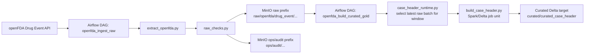
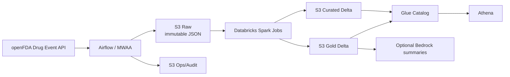

# Architecture

This project is intentionally built in two views:
- a local development view that is easy to run on a laptop
- a target AWS view that matches the portfolio architecture

## Local Development Flow

## Current Code Path

The implemented ingestion flow is fully runnable locally today:
- Airflow resolves the monthly or manual batch window.
- The openFDA client paginates the API by `receivedate`.
- Raw records are wrapped in bronze-style envelopes and written as immutable NDJSON.
- A batch audit document is written even when raw DQ fails.

Milestone 2 now has the first curated orchestration slice in place:
- `curated_case_header` Spark transformation logic exists.
- raw batch selection logic can resolve the latest raw object for a given reporting window.
- a curated build DAG prepares the job manifest that the Spark or Databricks runner will execute.

## Target AWS Architecture

## Why MinIO Exists In Dev

MinIO is only the local development substitute for S3.

It lets us:
- test S3 object writes and prefix layout locally
- keep the boto3 code identical between dev and AWS
- avoid coupling local development to a live cloud account

The portability comes from configuration:
- in dev, `S3_ENDPOINT_URL` points boto3 at MinIO
- in AWS, `S3_ENDPOINT_URL` is removed and boto3 uses native S3

## AWS Service Plan

Planned AWS services by layer:
- orchestration: Airflow, with MWAA as the clean hosted target
- storage: Amazon S3 for `raw`, `ops/audit`, `curated`, and `gold`
- transforms: Databricks Spark jobs writing Delta Lake tables to S3
- metadata: AWS Glue Catalog
- query layer: Athena
- secrets: Secrets Manager for Databricks tokens and any protected configs
- security and ops: IAM, KMS, and CloudWatch

## Migration From Dev To AWS

The code path is designed so the migration is mostly configuration and packaging:
- replace MinIO bucket settings with a real S3 bucket
- remove `S3_ENDPOINT_URL`
- switch from static local credentials to IAM roles
- package the curated Spark jobs for Databricks execution
- register curated and gold Delta tables in Glue
- query them through Athena
