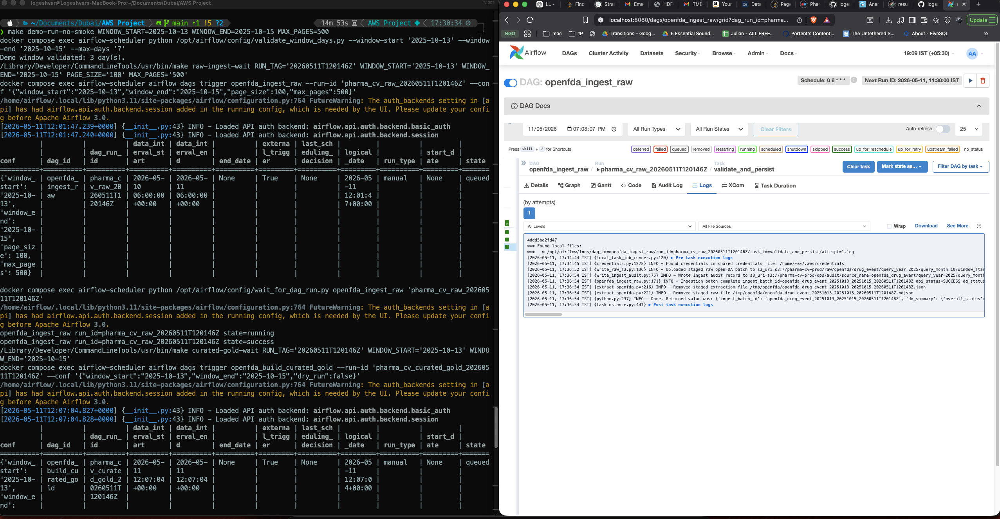
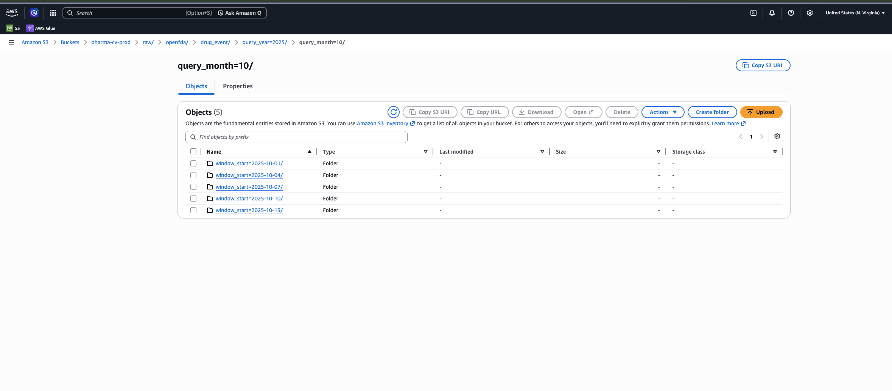
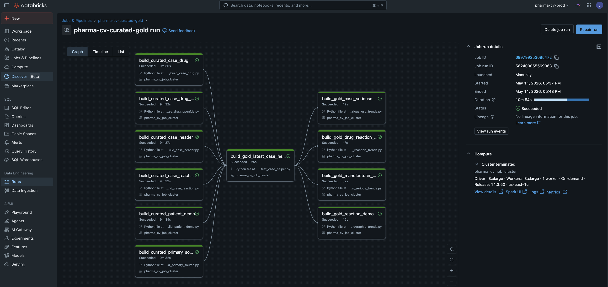
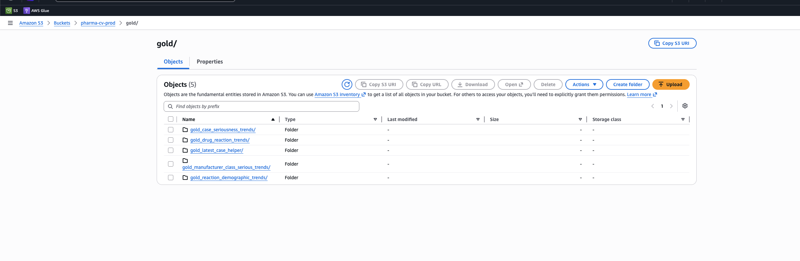
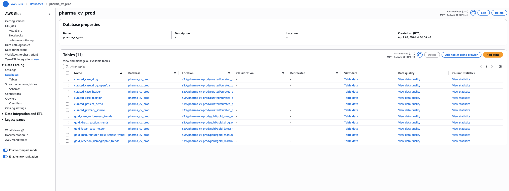
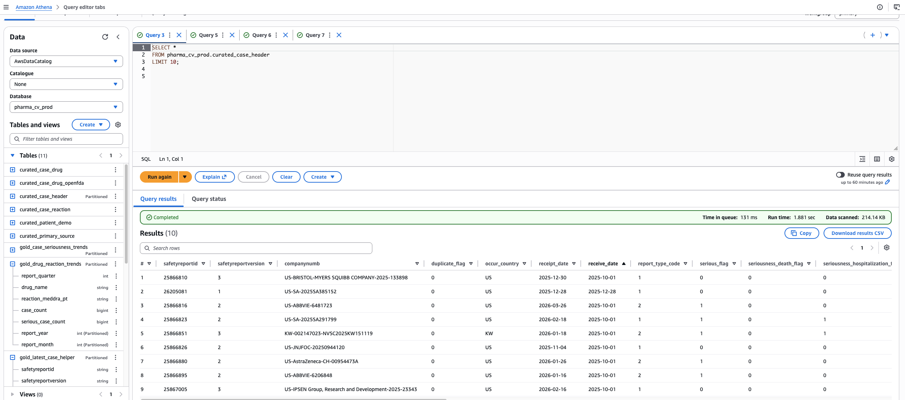
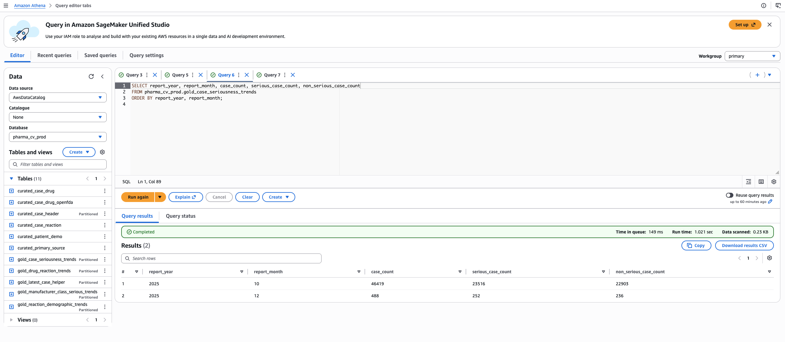
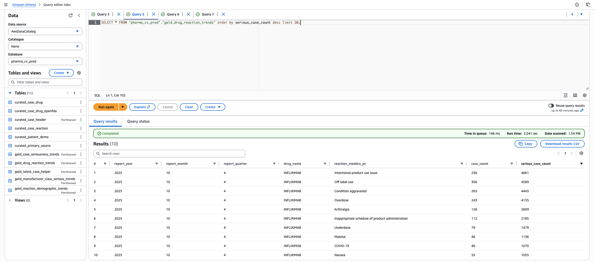
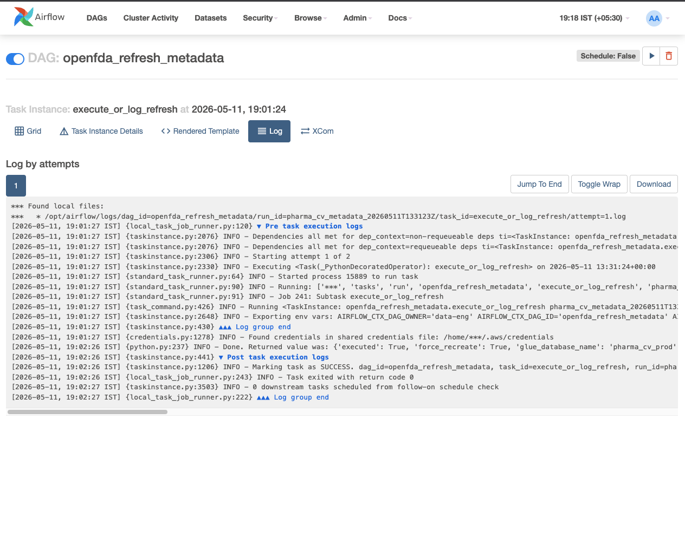
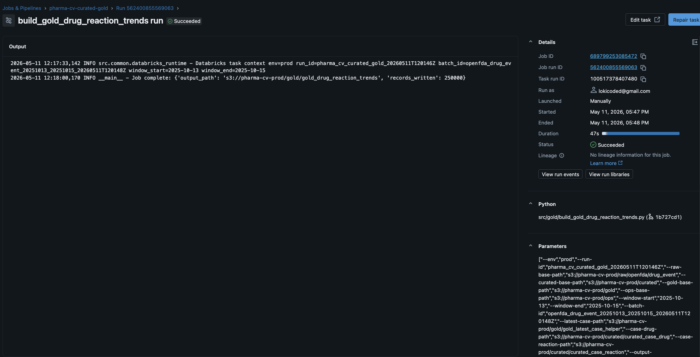

# Pharma Covigilance Reporting Pipeline: Demo Evidence

This document captures evidence for the batch pharmacovigilance reporting pipeline built with Airflow, Amazon S3 storage, Databricks Spark jobs, Delta tables, AWS Glue Catalog, and Athena.

The demo uses openFDA drug adverse event data for safety signal monitoring and reporting. The analysis represents adverse event co-reporting patterns within case reports. It does not diagnose patients, infer causality, or prove that a product caused a reaction.

## Demo Scope

Demo data loaded:

- Source: openFDA drug adverse event API
- Date range: `2025-10-01` to `2025-10-15`
- Ingestion style: batch window extraction in smaller local backfill windows for reliable Airflow execution
- Raw storage: append-only NDJSON in S3
- Curated storage: Delta tables preserving report versions
- Gold storage: Delta tables using the latest report version per `safetyreportid`
- Query access: Glue Catalog tables queried through Athena

## Architecture Evidence

The pipeline follows a batch AWS-style architecture:

1. Airflow orchestrates raw ingestion, Databricks transformation submission, and metadata refresh.
2. Raw openFDA API payloads land in S3 under the raw zone with audit metadata in the ops zone.
3. Databricks Spark jobs run from Git source and write curated and gold Delta tables to S3.
4. Glue Catalog metadata is refreshed so Athena can query curated and gold outputs.
5. Optional Bedrock-generated safety summaries are planned as a future enhancement on top of gold outputs.



Evidence shown:

- `openfda_ingest_raw` completed successfully.
- Extraction, validation, S3 raw write, and audit write are orchestrated as Airflow tasks.
- The DAG supports manual backfill windows through runtime config.

## Raw And Ops Landing



Evidence shown:

- Raw data lands under `raw/openfda/drug_event/`.
- Ingestion audit metadata lands under `ops/audit/`.
- Raw files are append-only and partitioned by query window and `ingest_batch_id`.

Raw S3 landing pattern:

```text
s3://pharma-cv-prod/raw/openfda/drug_event/
  query_year=YYYY/
  query_month=MM/
  window_start=YYYY-MM-DD/
  window_end=YYYY-MM-DD/
  ingest_batch_id=<batch_id>/
  <source_file>.ndjson
```

## Databricks Transformation Run



Evidence shown:

- Airflow submits a Databricks multi-task job.
- The job runs from Git source instead of locally staged Python files or wheel packaging.
- Curated table tasks run before gold table tasks.
- Gold outputs depend on the latest-case helper, which selects the latest report version per `safetyreportid`.

Databricks task order:

1. `curated_case_header`
2. `curated_primary_source`
3. `curated_patient_demo`
4. `curated_case_drug`
5. `curated_case_drug_openfda`
6. `curated_case_reaction`
7. `gold_latest_case_helper`
8. `gold_case_seriousness_trends`
9. `gold_drug_reaction_trends`
10. `gold_reaction_demographic_trends`
11. `gold_manufacturer_class_serious_trends`

## Curated And Gold Delta Storage



Evidence shown:

- Curated Delta tables are written under the curated zone.
- Gold Delta tables are written under the gold zone.
- Tables are partition-aware so rerunning a small window does not replace unrelated history.

Curated examples:

- `curated_case_header`
- `curated_primary_source`
- `curated_patient_demo`
- `curated_case_drug`
- `curated_case_drug_openfda`
- `curated_case_reaction`

Gold examples:

- `gold_case_seriousness_trends`
- `gold_drug_reaction_trends`
- `gold_reaction_demographic_trends`
- `gold_manufacturer_class_serious_trends`

## Glue Catalog Registration



Evidence shown:

- Glue database `pharma_cv_prod` contains curated and gold tables.
- Athena can discover the Delta-backed tables through the catalog.
- Metadata refresh is orchestrated separately from transformation to keep responsibilities clear.

## Athena Validation

### Curated Case Header Sample



Query:

```sql
SELECT *
FROM pharma_cv_prod.curated_case_header
LIMIT 10;
```

What this proves:

- Curated case headers are queryable through Athena.
- The source report version grain is preserved in the curated layer.
- Core case attributes such as country, receipt dates, seriousness flags, and report version fields are available for downstream analysis.

### Seriousness Trend



Query:

```sql
SELECT report_year, report_month, case_count, serious_case_count, non_serious_case_count
FROM pharma_cv_prod.gold_case_seriousness_trends
ORDER BY report_year, report_month;
```

What this proves:

- Gold trend tables are available through Athena.
- Reporting uses latest report versions rather than all historical versions.
- Serious and non-serious case counts are pre-aggregated for BI-style consumption.
- The screenshot shows October 2025 reporting volume from the demo backfill, plus an additional December partition from earlier validation data.

### Drug And Reaction Co-Reporting



Query:

```sql
SELECT *
FROM pharma_cv_prod.gold_drug_reaction_trends
ORDER BY serious_case_count DESC
LIMIT 10;
```

What this proves:

- Nested drug and reaction arrays were normalized into analytical entities.
- The gold table supports drug/reaction co-reporting analysis with case counts and serious case counts.
- These are co-reported events in the same case report, not causal claims.

## Metadata And Runtime Evidence

### Metadata Refresh DAG



Evidence shown:

- `openfda_refresh_metadata` completed after Databricks wrote curated and gold outputs.
- Metadata refresh is treated as a separate operational step, which keeps compute transformation and query registration responsibilities cleanly separated.

### Databricks Task Logs



Evidence shown:

- Databricks tasks run from Git-backed Spark Python files.
- The task output confirms records were written to S3-backed Delta tables.
- This gives a concrete runtime trace from orchestration to transformation output.

## Additional Queries To Capture Later

The current evidence pack already covers the full pipeline. These optional queries can be captured later if you want to show more analytical depth.

Reaction demographic trends:

```sql
SELECT reaction_meddra_pt, patientsex_label, derived_age_band, reporter_country, report_count
FROM pharma_cv_prod.gold_reaction_demographic_trends
ORDER BY report_count DESC
LIMIT 25;
```

Manufacturer and pharmacologic class serious trends:

```sql
SELECT manufacturer_name, pharm_class_epc, serious_case_count
FROM pharma_cv_prod.gold_manufacturer_class_serious_trends
ORDER BY serious_case_count DESC
LIMIT 25;
```

## Interview Talking Points

- The raw zone is immutable and append-only, which preserves source fidelity and supports reprocessing.
- Curated tables preserve all report versions using `safetyreportid` and `safetyreportversion`.
- Gold tables use the latest version per `safetyreportid` to avoid double-counting updated reports.
- Drug and reaction entities are independent children of a report version, so drug/reaction analysis is co-reporting, not causality.
- Airflow handles orchestration while Databricks handles distributed transformation.
- Glue and Athena provide metadata and SQL access without tightly coupling analysis to Databricks.
- Secrets are kept out of source code, with local AWS SSO/profile support and Secrets Manager-style Databricks credentials.
- The demo uses smaller ingestion windows locally to avoid resource pressure, while the architecture still supports batch backfill patterns.

## Future Enhancement

An optional Bedrock layer can be added later to generate short narrative summaries from gold aggregates. This should sit after the gold layer and should summarize reporting patterns only, without making medical, diagnostic, or causal claims.
